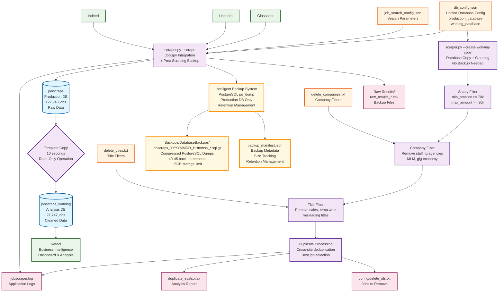
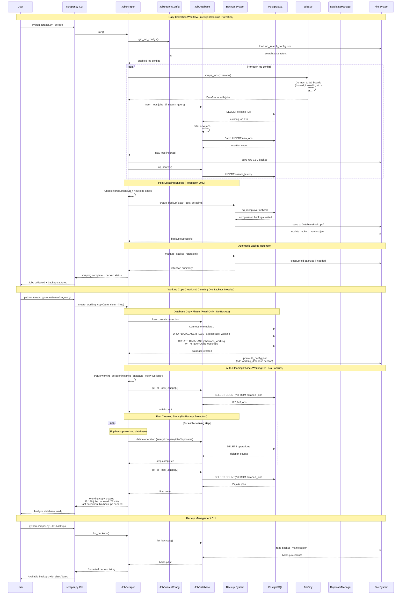

# JobScraps Project

## Current Architecture Summary

### **Module Structure**

- **`scraper.py`** - Main application controller and orchestrator with intelligent backup system
- **`migration_script.py`** - SQLite to PostgreSQL data migration utility
- **`verify_setup.py`** - PostgreSQL setup verification and troubleshooting
- **`compare_databases.sh`** - Database comparison and efficiency analysis
- **`workflow_scripts.sh`** - Bash automation for common workflows

### **Database Schema**

**Primary Database:** `jobscraps` (PostgreSQL 14 on Windows Docker) contains all new jobs found from prior scrapes. The data is raw - before the data cleaning operations.

- **`scraped_jobs`** - Main job postings table (122k+ records)
    - Primary key: `id` (TEXT)
    - Indexed: `title`, `company`, `LOWER(search_query)`, `date_scraped`
    - Data types: `is_remote` (BOOLEAN), `min_amount/max_amount` (DECIMAL), `date_scraped` (TIMESTAMP)
- **`search_history`** - Log of scraping operations
    - Auto-increment primary key, tracks search parameters and results

**Working Database:** `jobscraps_working` (Fixed name for Retool)

- Identical structure to production
- Contains cleaned/filtered data (~27k records after 77% reduction)

### **Integration Points**

**Configuration Sources:**

- `config/db_config.json` → PostgreSQL connection parameters (unified config with production_database and working_database sections)
- `config/job_search_config.json` → JobSpy scraping parameters
- `config/delete_companies.txt` → Company filtering patterns
- `config/delete_titles.txt` → Job title filtering patterns

**External Dependencies:**

- **JobSpy** - Job scraping library (indeed, linkedin, glassdoor)
- **PostgreSQL** - Database engine (192.168.1.31:5432)
- **Retool** - BI/analysis frontend (connects to jobscraps_working)
- **psycopg2-binary** - PostgreSQL Python adapter
- **pg_dump/psql** - PostgreSQL backup and restore utilities

**File Outputs:**

- `duplicate_evals.xlsx` → Excel reports with duplicate analysis
- `config/delete_ids.txt` → Job IDs marked for deletion
- `./Raw Results/raw_results_*.csv` → Backup of raw scraping results
- `jobscraper.log` → Application logging
- `Backups/DatabaseBackups/` → PostgreSQL native backups with retention management
- `Backups/backup_manifest.json` → Backup metadata and tracking
- `Backups/` → Legacy CSV backups and migration artifacts

## Data Flow Architecture

### Data Flow Architecture



#### **Data Sources** (Green)

- Job boards: Indeed, LinkedIn, Glassdoor
- External system: Retool for analysis

#### **Configuration** (Orange)

- Unified database configuration with production and working database sections
- Search parameters, filter patterns

#### **Processing** (Purple)

- Main scraper application with intelligent backup protection
- Working copy creation with 4-step cleaning pipeline (no backups needed)
- Template copy operation (read-only, no backup required)

#### **Databases** (Blue)

- Production database (raw 122k+ jobs)
- Working database (cleaned 27k jobs)

#### **Intelligent Backup System** (Yellow/Gold)

- **Production-Only Backups**: Only creates backups for production database operations
- **Post-Scraping Backups**: Captures new data state after successful scraping
- **PostgreSQL Native**: Compressed pg_dump backups over network
- **Retention Management**: 40-45 backup limit, ~5GB storage
- **Safety Warnings**: Warns users when attempting data cleaning on production
- **Skip Unnecessary Backups**: No backups for working database operations or read-only operations

#### **Outputs** (Pink)

- Backup files, Excel reports, logs, delete lists
- Raw Results CSV files (granular, per-scraping-session)

#### **Key Data Transformations**

1. **Collection**: 122,943 raw jobs → Production DB + post-scraping backup
2. **Template Copy**: Production → Working (10 seconds, no backup - read-only operation)
3. **Cleaning Pipeline** (no backups needed - operates on working database copy):
    - Salary filter (removes bulk)
    - Company filter (staffing agencies, MLM)
    - Title filter (sales, gig work)
    - Duplicate processing (cross-site deduplication)
4. **Final Result**: 27,747 high-quality jobs (77% reduction)

### Sequence Diagram with Intelligent Backup Integration



#### **Key Intelligent Backup Features**

1. **Production-Only Backups**: Only creates backups when operating on production database
2. **Post-Scraping Timing**: Backups capture new data state after successful scraping
3. **Read-Operation Safety**: No backups for safe read operations (creating working copy)
4. **Working Database Efficiency**: Data cleaning operations skip backups for speed
5. **User Safety Warnings**: Alerts when attempting data cleaning on production database
6. **Retention Management**: Automatic cleanup maintains 40-45 backups within 5GB limit
7. **Network Backup**: pg_dump connects directly to Windows PostgreSQL over private network
8. **Manifest Tracking**: JSON metadata tracks all backups with sizes, timestamps, reasons

## Class Architecture (Current State)

### **Core Classes**

**`DatabaseConfig`** _(Enhanced)_

- **Purpose:** Load and manage PostgreSQL connection configuration with database type selection
- **Key Methods:**
    - `get_connection_params()` - Now supports production_database/working_database sections
    - `get_retry_config()` - Connection retry configuration
- **New Features:**
    - `database_type` parameter ("production" or "working")
    - Backwards compatibility with legacy `database` config format
- **Dependencies:** `config/db_config.json` (unified configuration)

**`JobDatabase`** _(Significantly Enhanced)_

- **Purpose:** PostgreSQL operations, connection management, and integrated backup system
- **Core Data Methods:**
    - `insert_jobs()` - Batch insert with duplicate detection
    - `get_duplicate_groups()` - Identify duplicate jobs across sites
    - `delete_jobs_by_*()` - Various deletion methods (salary, company, title, IDs)
    - `clear_all_jobs()`, `backup_and_reset()`
- **NEW Backup Methods:**
    - `create_backup()` - PostgreSQL pg_dump with compression and retry logic
    - `_update_backup_manifest()` - JSON metadata management
    - `manage_backup_retention()` - Automatic cleanup (40-45 backups, 5GB limit)
    - `list_backups()` - Available backup inventory
    - `restore_backup()` - Database restoration from backup
    - `test_backup()` - Backup file integrity verification
- **Enhanced Features:**
    - Network backup over private connection (MacBook ↔ Windows PostgreSQL)
    - Automatic retention management
    - Comprehensive error handling and retry logic
    - User-friendly backup status reporting
- **Dependencies:** psycopg2, pandas, subprocess (pg_dump/psql), DatabaseConfig

**`DuplicateManager`** _(Unchanged)_

- **Purpose:** Sophisticated duplicate detection and ranking algorithm
- **Key Methods:**
    - `identify_duplicates()` - Find and rank duplicate groups
    - `_select_best_job()` - Complex ranking algorithm (description, location, salary, remote, site preference)
    - `create_excel_report()` - Generate duplicate analysis reports
- **Algorithm Priority:** Description > Colorado location > Salary > Remote > Site preference > Date

**`JobSearchConfig`** _(Unchanged)_

- **Purpose:** Manage JobSpy scraping configuration
- **Key Methods:** `get_job_configs()`, `get_global_params()`
- **Dependencies:** `config/job_search_config.json`

**`JobScraper`** _(Significantly Enhanced)_

- **Purpose:** Coordinate all operations, provide CLI interface, and ensure intelligent backup protection
- **Core Workflow Methods:**
    - `run()` - Execute scraping workflow (with post-scraping backup)
    - `create_working_copy()` - Database copy + automatic cleaning (no backup needed)
    - `process_duplicates()` - Run duplicate detection workflow (production backup only)
    - Various deletion methods as CLI interface (with safety warnings)
- **NEW Intelligent Backup Protection:**
    - `_create_backup_with_prompt()` - Production database backup with user prompt on failure
    - Post-scraping backups capture new data state
    - Working database operations skip backups for efficiency
    - Safety warnings for production database data cleaning
- **NEW Backup Management CLI:**
    - `manual_backup()` - Create manual backups
    - `list_backups()` - Display available backups with metadata
    - `restore_backup()` - Restore from specific backup file
    - `test_backup()` - Verify backup file integrity
    - `cleanup_backups()` - Force retention cleanup
- **Enhanced Configuration:**
    - Single `db_config.json` with automatic working_database section creation
    - `database_type` parameter for production/working database selection
    - Eliminated separate `db_config_working.json` dependency
- **Dependencies:** All other classes plus subprocess for backup operations

### **New CLI Commands**

```bash
# Backup Management
python scraper.py --backup                              # Create manual backup
python scraper.py --list-backups                        # Show all backups with metadata
python scraper.py --restore-backup filename.sql.gz      # Restore from specific backup
python scraper.py --test-backup filename.sql.gz         # Test backup file integrity
python scraper.py --cleanup-backups                     # Force cleanup old backups

# Database Selection
python scraper.py --working --delete-by-salary          # Use working database (no backup)
python scraper.py --scrape                              # Use production database (post-backup)

# Intelligent Backup Operations
python scraper.py --scrape                              # Post-scraping backup (production only)
python scraper.py --create-working-copy                 # No backup (read-only operation)
python scraper.py --delete-by-salary                    # Warning + backup (if production)
python scraper.py --working --delete-by-salary          # No warning, no backup (working DB)
```

### **Configuration Structure**

**Updated `db_config.json` Format:**

```json
{
  "production_database": {
    "host": "192.168.1.31",
    "port": 5432,
    "database": "jobscraps",
    "username": "jonesy",
    "password": "password"
  },
  "working_database": {
    "host": "192.168.1.31",
    "port": 5432,
    "database": "jobscraps_working",
    "username": "jonesy",
    "password": "password"
  },
  "connection": {
    "connect_timeout": 30,
    "command_timeout": 300,
    "retry_attempts": 3,
    "retry_delay": 5,
    "pool_size": 5,
    "max_overflow": 10
  },
  "ssl": {
    "enabled": false,
    "require": false
  },
  "logging": {
    "log_queries": false,
    "log_slow_queries": true,
    "slow_query_threshold": 5.0
  }
}
```

### **Intelligent Backup System Architecture**

**File Structure:**

```markdown
Backups/
├── DatabaseBackups/                                    # PostgreSQL native backups
│   ├── jobscraps_20250615_081044_auto_post_scraping.sql.gz  # Post-scraping backups
│   ├── jobscraps_20250614_150030_manual.sql.gz        # Manual backups
│   ├── jobscraps_20250614_161245_auto_deletion.sql.gz # Pre-deletion backups (production only)
│   └── backup_manifest.json                           # Backup metadata and tracking
├── [legacy CSV backups]                               # Existing backup files (preserved)
└── [migration artifacts]                              # Database migration files
```

**Backup Naming Convention:** `jobscraps_YYYYMMDD_HHmmss_[type]_[reason].sql.gz`

- **Type**: `auto` (automatic) or `manual`
- **Reason**: `post_scraping`, `deletion`, `duplicates`, `manual`, etc.
- **Examples**:
    - `jobscraps_20250615_081044_auto_post_scraping.sql.gz`
    - `jobscraps_20250614_150030_manual.sql.gz`

**Backup Logic:**

- **✅ Backup Created**: Production database operations with data changes
- **⚡ Backup Skipped**: Working database operations, read-only operations
- **⚠️ User Warning**: Data cleaning operations attempted on production database

**Retention Policy:**

- **Target**: 40-45 backups (~4.5 GB)
- **Cleanup Trigger**: >48 backups or >4.8 GB
- **Cleanup Action**: Remove oldest backups to reach 40 backup target
- **Automatic**: Runs after each backup creation

**Network Architecture:**

- **Source**: MacBook (scraper.py execution)
- **Target**: Windows Docker PostgreSQL (192.168.1.31:5432)
- **Protocol**: pg_dump over private network connection
- **Authentication**: Uses existing db_config.json credentials
- **Performance**: ~30-60 seconds for 600MB → 100MB compressed

## Typical Workflow Examples

### **Daily Scraping Workflow**

```bash
# Fast and efficient - post-scraping backup captures new data
python scraper.py --scrape
# Output: "Scraping completed with 5 new jobs added."
#         "Creating backup to capture new data..."
#         "✓ Post-scraping backup created: jobscraps_20250615_081044_auto_post_scraping.sql.gz"
```

### **Data Analysis Workflow**

```bash
# Fast - no backup needed for database copy creation
python scraper.py --create-working-copy
# Output: "No backup needed - we're just copying the production database to create working copy"
#         "Working copy created with automatic cleaning..."
#         "95,196 jobs removed (77.4%) - Fast execution: No backups needed"

# Fast working database operations
python scraper.py --working --delete-by-salary 80000,100000
# Output: "Skipping backup (operating on working database)"
```

### **Production Data Cleaning (with Safety)**

```bash
# Protected with warning
python scraper.py --delete-by-salary
# Output: "⚠️  WARNING: Running data cleaning against PRODUCTION database!"
#         "Consider using --create-working-copy for data cleaning operations."
#         "Continue with production database cleaning? (y/n):"
```

This intelligent backup architecture provides comprehensive protection for production data while maintaining efficiency for development and analysis workflows.

## Database Schema

Database schema is captured in "jobscraps_schema.sql" which can be generated with

```sh
(base) jonesy@Skippy jobscrape % pg_dump -h 192.168.1.31 -p 5432 -U jonesy -d jobscraps \
  --schema-only \
  --clean \
  --if-exists \
  --no-owner \
  --no-privileges \
  > jobscraps_schema.sql
```

### 'scraped_jobs' columns that do and do not have data

Columns that do not have data are kept as placeholders. List is accurate as of 2025-06-16.

**Columns with data**
- job_url_direct
- salary_source
- job_level
- job_function
- emails
- company_logo
- company_url_direct
- company_addresses
- company_num_employees
- company_revenue


**Columns without data and safe to ignore**

- skills
- experience_range
- company_rating
- company_reviews_count
- vacancy_count
- work_from_home_type
