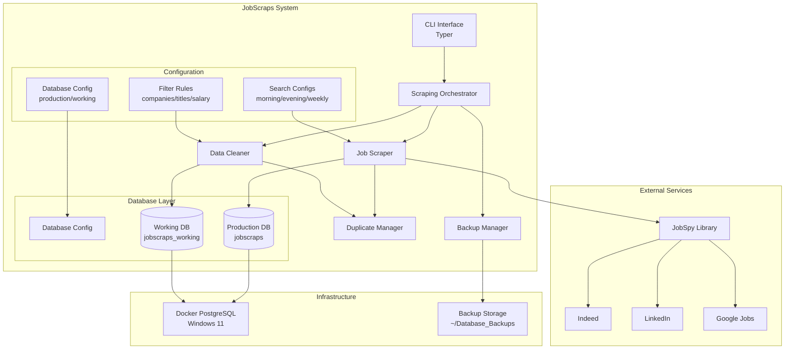
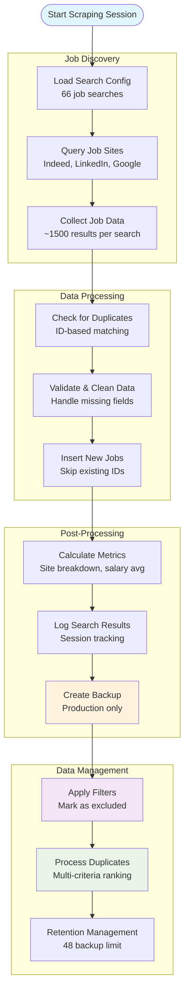
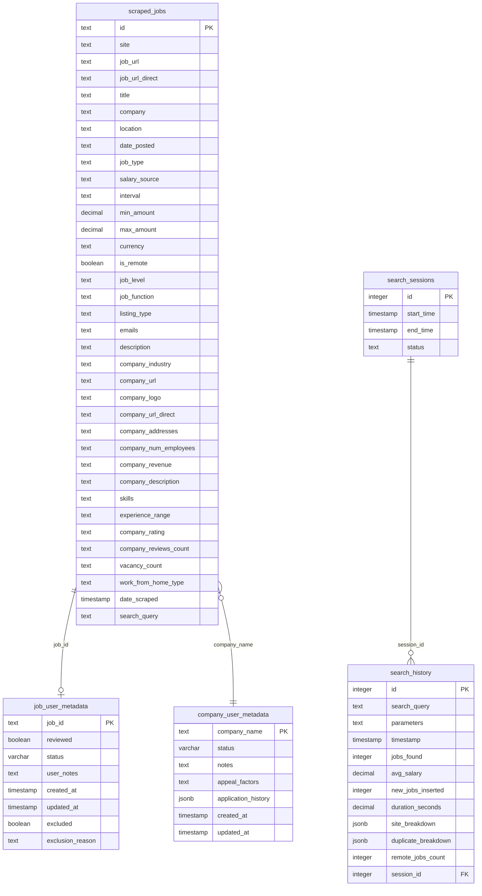
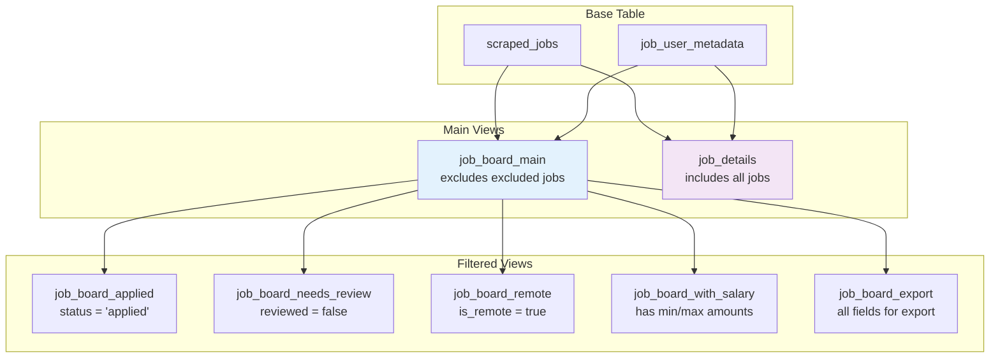
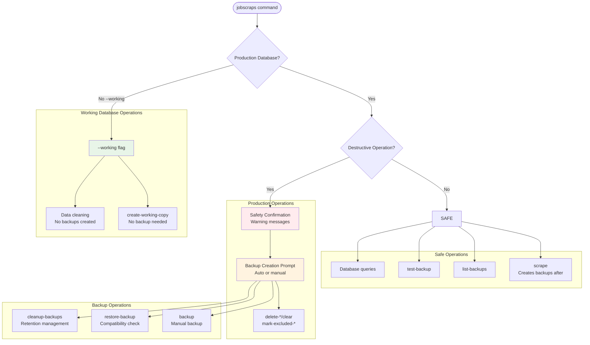
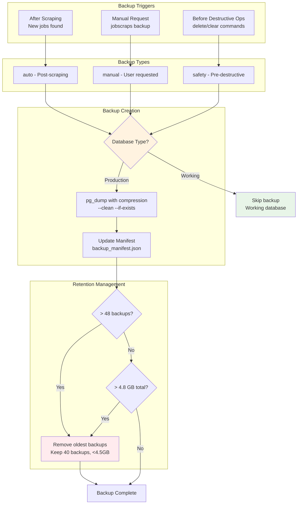

# JobScraps - Intelligent Job Scraping & Data Management System

> A comprehensive job scraping platform with PostgreSQL backend, intelligent duplicate detection, and production-safe data management workflows.

## 🚀 Features

- **Multi-Site Job Scraping**: Automated scraping from Indeed, LinkedIn, and Google Jobs
- **Intelligent Duplicate Detection**: Multi-criteria algorithm for identifying and managing duplicates
- **Production-Safe Operations**: Separate production/working database model with automatic backups
- **Advanced Filtering**: Pattern-based exclusion rules for companies, job titles, and salary ranges
- **Session Tracking**: Complete audit trail of all scraping operations
- **Backup Management**: Automated backup creation, retention policies, and restore capabilities
- **CLI Interface**: Comprehensive command-line tools for all operations

## 📋 Table of Contents

- [Architecture Overview](#architecture-overview)
- [Quick Start](#quick-start)
- [Installation](#installation)
- [Configuration](#configuration)
- [Usage Examples](#usage-examples)
- [Database Schema](#database-schema)
- [CLI Reference](#cli-reference)
- [Advanced Usage](#advanced-usage)
- [Troubleshooting](#troubleshooting)

## 🏗️ Architecture Overview

### System Architecture



### Data Flow Pipeline



### Database Schema & Relationships



### Database Views Structure



### CLI Command Decision Tree



### Duplicate Detection Algorithm

```mermaid
flowchart TD
    START([Duplicate Group<br/>Same title + company])
    
    DESC_CHECK{Jobs with<br/>descriptions?}
    LOC_CHECK{Preferred location<br/>matches?}
    SALARY_CHECK{Jobs with<br/>salary > 0?}
    SALARY_MAX{Multiple with<br/>max salary?}
    REMOTE_CHECK{Mixed remote<br/>status?}
    QUERY_CHECK{Non-US search<br/>queries?}
    SITE_PREF{Site preference<br/>order?}
    DATE_CHECK{Most recent<br/>date_posted?}
    
    KEEP_DESC[Keep jobs with descriptions]
    KEEP_LOC[Keep preferred location]
    KEEP_SALARY[Keep jobs with salary]
    KEEP_MAX_SAL[Keep highest salary]
    KEEP_REMOTE[Keep remote jobs]
    KEEP_NON_US[Keep non-US queries]
    KEEP_SITE[Keep by site preference<br/>linkedin > indeed > google]
    KEEP_RECENT[Keep most recent]
    FALLBACK[Keep first job]

    START --> DESC_CHECK
    DESC_CHECK -->|Yes, filter available| KEEP_DESC
    DESC_CHECK -->|No differences| LOC_CHECK
    KEEP_DESC --> LOC_CHECK
    
    LOC_CHECK -->|Yes, filter available| KEEP_LOC
    LOC_CHECK -->|No differences| SALARY_CHECK
    KEEP_LOC --> SALARY_CHECK
    
    SALARY_CHECK -->|Yes, filter available| KEEP_SALARY
    SALARY_CHECK -->|No differences| REMOTE_CHECK
    KEEP_SALARY --> SALARY_MAX
    
    SALARY_MAX -->|Yes| KEEP_MAX_SAL
    SALARY_MAX -->|No| REMOTE_CHECK
    KEEP_MAX_SAL --> REMOTE_CHECK
    
    REMOTE_CHECK -->|Yes, prefer remote| KEEP_REMOTE
    REMOTE_CHECK -->|No differences| QUERY_CHECK
    KEEP_REMOTE --> QUERY_CHECK
    
    QUERY_CHECK -->|Yes, prefer non-US| KEEP_NON_US
    QUERY_CHECK -->|No differences| SITE_PREF
    KEEP_NON_US --> SITE_PREF
    
    SITE_PREF -->|Apply preference order| KEEP_SITE
    SITE_PREF -->|Still tied| DATE_CHECK
    KEEP_SITE --> DATE_CHECK
    
    DATE_CHECK -->|Available| KEEP_RECENT
    DATE_CHECK -->|Not available| FALLBACK
    KEEP_RECENT --> FALLBACK
    
    style START fill:#e1f5fe
    style FALLBACK fill:#e8f5e8
    style KEEP_DESC fill:#fff3e0
    style KEEP_SALARY fill:#f3e5f5
```



### Backup Strategy Flow



## 🚀 Quick Start

### Prerequisites

- Python 3.10+
- Docker (for PostgreSQL)
- macOS/Linux (tested on macOS)

### 1. Setup PostgreSQL with Docker

```bash
# Start PostgreSQL container on Windows 11
docker run --name jobscraps-postgres \
  -e POSTGRES_DB=jobscraps \
  -e POSTGRES_USER=your_username \
  -e POSTGRES_PASSWORD=your_password \
  -p 5432:5432 \
  -d postgres:15
```

### 2. Install JobScraps

```bash
git clone https://github.com/yourusername/jobscraps.git
cd jobscraps
pip install -e .
```

### 3. Configure Database

```bash
cp configs/db/db_config.json.template configs/db/db_config.json
# Edit with your database credentials
```

### 4. Run Your First Scrape

```bash
# Basic scraping
jobscraps scrape

# Create a working copy for safe data exploration
jobscraps create-working-copy

# Work with the working database
jobscraps --working scrape
```

## 📦 Installation

### System Requirements

- **Python**: 3.10 or higher
- **Database**: PostgreSQL 12+ (Docker recommended)
- **Memory**: 4GB+ RAM recommended for large datasets
- **Storage**: Varies by data volume (backups use ~100MB per 50k jobs)

### Installation Steps

1. **Clone the repository:**
   ```bash
   git clone https://github.com/yourusername/jobscraps.git
   cd jobscraps
   ```

2. **Create virtual environment:**
   ```bash
   python -m venv .venv
   source .venv/bin/activate  # On Windows: .venv\Scripts\activate
   ```

3. **Install dependencies:**
   ```bash
   pip install -e .
   ```

4. **Setup PostgreSQL:**
   ```bash
   # Using Docker (recommended)
   docker run --name jobscraps-postgres \
     -e POSTGRES_DB=jobscraps \
     -e POSTGRES_USER=your_username \
     -e POSTGRES_PASSWORD=your_password \
     -p 5432:5432 \
     -v jobscraps_data:/var/lib/postgresql/data \
     -d postgres:15
   ```

5. **Configure the application:**
   ```bash
   cp configs/db/db_config.json.template configs/db/db_config.json
   # Edit configs/db/db_config.json with your database credentials
   ```

6. **Verify installation:**
   ```bash
   jobscraps --help
   ```

## ⚙️ Configuration

### Database Configuration

The `configs/db/db_config.json` file supports separate production and working databases:

```json
{
  "production_database": {
    "host": "localhost",
    "port": 5432,
    "database": "jobscraps",
    "username": "your_username",
    "password": "your_password"
  },
  "working_database": {
    "host": "localhost", 
    "port": 5432,
    "database": "jobscraps_working",
    "username": "your_username",
    "password": "your_password"
  },
  "connection": {
    "connect_timeout": 30,
    "command_timeout": 300,
    "retry_attempts": 3,
    "retry_delay": 5
  }
}
```

### Search Configuration

Job search configurations define what jobs to scrape. Example `configs/search/job_search_config.json`:

```json
{
  "jobs": [
    {
      "name": "Data Analyst (Boulder, Remote)",
      "enabled": true,
      "parameters": {
        "site_name": ["indeed", "linkedin", "google"],
        "search_term": "Data Analyst",
        "location": "Boulder, CO",
        "google_search_term": "Remote Data Analyst jobs near Boulder CO since yesterday",
        "country_indeed": "USA",
        "is_remote": true,
        "linkedin_fetch_description": true,
        "hours_old": 24,
        "results_wanted": 1500
      }
    }
  ],
  "global": {
    "description_format": "markdown",
    "enforce_annual_salary": true,
    "verbose": 2
  }
}
```

### Filter Configurations

Create filter files to exclude unwanted jobs:

- `configs/filters/delete_companies.txt` - Company patterns to exclude
- `configs/filters/delete_titles.txt` - Job title patterns to exclude
- `configs/filters/delete_ids.txt` - Specific job IDs to exclude

Example filter patterns:
```
%behavioral%     # Exclude companies with "behavioral" in name
%car %          # Exclude titles with "car " (with space)
```

## 🎯 Usage Examples

### Basic Scraping

```bash
# Scrape using default configuration
jobscraps scrape

# Use specific configuration file
jobscraps --config configs/search/morning_job_search_config.json scrape

# Use working database (no backups created)
jobscraps --working scrape
```

### Data Management

```bash
# Create a working copy for safe operations
jobscraps create-working-copy

# Mark jobs as excluded (preserves data)
jobscraps mark-excluded-by-salary 70000,90000
jobscraps mark-excluded-by-company configs/filters/delete_companies.txt

# Hard delete operations (use with caution)
jobscraps --working delete-by-salary 70000,90000
jobscraps --working clear

# Process duplicates
jobscraps process-duplicates
```

### Backup Operations

```bash
# Create manual backup
jobscraps backup

# List available backups
jobscraps list-backups

# Test backup integrity
jobscraps test-backup jobscraps_20250127_143022_manual.sql.gz

# Restore from backup
jobscraps restore-backup jobscraps_20250127_143022_manual.sql.gz

# Clean up old backups
jobscraps cleanup-backups
```

### Advanced Filtering

```bash
# Apply all configured filtering rules
jobscraps apply-filtering-rules

# Remove exclusion marks (make jobs visible again)
jobscraps unmark-excluded
jobscraps unmark-excluded --reason="salary_filter"
```

## 🗄️ Database Schema

### Core Tables

- **`scraped_jobs`**: Main job data with 35+ fields including salary, location, remote status
- **`job_user_metadata`**: User reviews, status tracking, and exclusion management
- **`company_user_metadata`**: Company-specific notes and application tracking
- **`search_sessions`**: Track scraping sessions with start/end times
- **`search_history`**: Detailed metrics for each search operation

### Key Views

- **`job_board_main`**: Primary view excluding marked jobs
- **`job_board_applied`**: Jobs marked as applied
- **`job_board_needs_review`**: Unreviewed jobs
- **`job_board_remote`**: Remote-only positions
- **`job_board_with_salary`**: Jobs with salary information

### Indexes

Optimized for common queries:
- GIN indexes for full-text search on descriptions and titles
- B-tree indexes for filtering by company, location, salary, remote status
- Composite indexes for complex queries

## 📖 CLI Reference

### Core Commands

| Command | Description | Production Safe |
|---------|-------------|-----------------|
| `scrape` | Run job scraping with configured searches | ✅ (creates backups) |
| `create-working-copy` | Create safe copy for data operations | ✅ |
| `backup` | Create manual backup | ✅ |
| `restore-backup` | Restore from backup file | ⚠️ (destructive) |

### Data Management

| Command | Description | Production Safe |
|---------|-------------|-----------------|
| `mark-excluded-by-*` | Mark jobs as excluded (preserves data) | ✅ |
| `delete-by-*` | Permanently delete jobs | ❌ (requires confirmation) |
| `clear` | Delete all job data | ❌ (requires confirmation) |
| `process-duplicates` | Identify and manage duplicates | ⚠️ (creates files) |

### Global Options

- `--working`: Use working database (skips backups)
- `--config PATH`: Specify custom search configuration
- `--db-config PATH`: Specify custom database configuration
- `--no-auto-clean`: Skip automatic cleaning when creating working copy

## 🔧 Advanced Usage

### Working Database Workflow

The working database system allows safe data exploration:

```bash
# 1. Create working copy with automatic cleaning
jobscraps create-working-copy

# 2. Experiment with data operations
jobscraps --working delete-by-salary 60000,80000
jobscraps --working process-duplicates

# 3. If satisfied, apply to production with backups
jobscraps mark-excluded-by-salary 60000,80000
```

### Custom Search Configurations

Create specialized search configurations for different scenarios:

```bash
# Morning searches (higher frequency)
jobscraps --config configs/search/morning_job_search_config.json scrape

# Weekly comprehensive searches
jobscraps --config configs/search/weekly_job_search_config.json scrape
```

### Backup Management Best Practices

```bash
# Regular backup verification
jobscraps test-backup-compatibility latest_backup.sql.gz

# Monitor backup storage
jobscraps list-backups | tail -10

# Automatic cleanup (keeps 40 backups, <4.5GB)
jobscraps cleanup-backups
```

## 🐛 Troubleshooting

### Database Connection Issues

**Error**: "Failed to connect after 3 attempts"

```bash
# Check PostgreSQL container status
docker ps | grep postgres

# Restart container if needed
docker restart jobscraps-postgres

# Verify connection parameters
psql -h localhost -p 5432 -U your_username -d jobscraps
```

### Backup/Restore Problems

**Error**: "Backup compatibility issues detected"

The system automatically filters incompatible PostgreSQL features:

```bash
# Test compatibility before restore
jobscraps test-backup-compatibility backup_file.sql.gz

# Force restore with filtering
jobscraps restore-backup backup_file.sql.gz --force
```

### Performance Issues

For large datasets (100k+ jobs):

1. **Index maintenance**: The system creates GIN indexes automatically
2. **Memory usage**: Increase Docker memory allocation
3. **Disk space**: Monitor backup directory size

### Common Error Solutions

**"is being accessed by other users"**
- Close all database connections
- Restart PostgreSQL container

**"Permission denied to create database"**
```sql
ALTER USER your_username CREATEDB;
```

**"No module named jobscraps"**
```bash
pip install -e .
```

## 📄 License

MIT License - see [LICENSE](LICENSE) file for details.

## 🤝 Contributing

See [CONTRIBUTING.md](CONTRIBUTING.md) for development setup and contribution guidelines.

---

**Built with**: Python 3.10+, PostgreSQL, JobSpy, Typer, Pandas